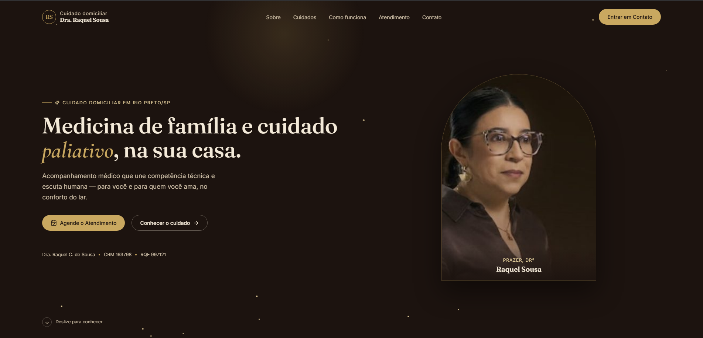

# 🩺 Dra. Raquel Sousa — Cuidado Domiciliar

Landing page profissional desenvolvida para serviços de medicina de família e cuidados paliativos domiciliares, unindo competência técnica, escuta humana e acolhimento.

---

## 📸 Demonstração do Projeto

<div align="center">
  
</div>

---

## 🚀 Tecnologias Utilizadas

Este projeto foi construído utilizando tecnologias modernas do ecossistema front-end:

* **Framework/Biblioteca:** React, Vite, JavaScript / TypeScript
* **Estilização:** Tailwind CSS / CSS Modules (com identidade visual sofisticada em tons terrosos/escuros e detalhes em dourado)
* **Hospedagem & Deploy:** Vercel

---

## ⚙️ Principais Funcionalidades

* **Design Responsivo:** Layout adaptado com fluidez para diferentes tamanhos de tela (computadores, tablets e smartphones).
* **Identidade Visual Sofisticada:** Paleta de cores planejada para transmitir seriedade, respeito profissional e acolhimento.
* **Apresentação Profissional & Registros:** Seções estruturadas destacando o CRM, RQE, especialidades e a filosofia de atendimento humanizado.
* **Informações de Cuidado Domiciliar:** Detalhamento claro sobre o funcionamento do acompanhamento médico em casa.
* **Contato e Agendamento Direto:** Canais integrados na interface para facilitar o contato direto com a profissional.

---

## ⚙️ Como Executar o Projeto Localmente

Certifique-se de ter o [Node.js](https://nodejs.org/) instalado em sua máquina.

1. **Clone o repositório:**
   ```bash
   git clone [https://github.com/gidelmarjr-art/dra-raquel-sousa.git](https://github.com/gidelmarjr-art/dra-raquel-sousa.git)